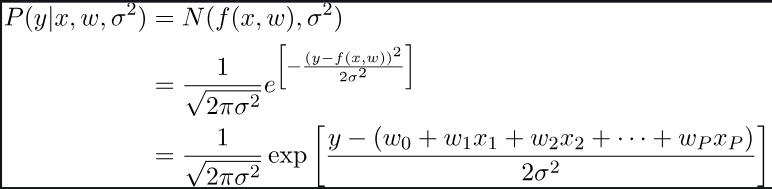
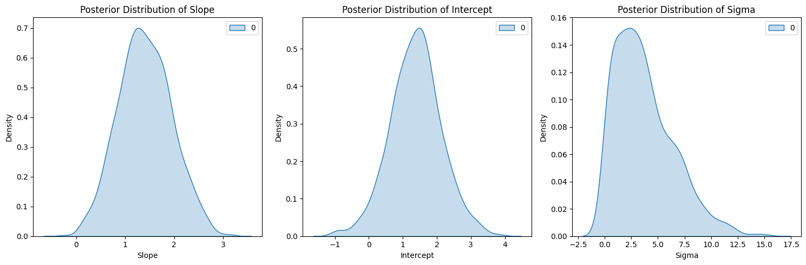

> **This is a university coursework exercise**, not a production model or a novel technique -- see [Assignment](Bayesian_regression_model.ipynb) for the original prompt it was written against. The author already removed it from the profile's Featured Work ("university coursework, not representative").

# Bayesian Regression with Pyro

This notebook demonstrates Bayesian linear regression using the Pyro library: generating simulated data with a known slope and intercept, defining priors for slope/intercept/sigma and a normal-noise likelihood, fitting the posterior with Stochastic Variational Inference (SVI), and visualizing the resulting posterior distributions.

The likelihood modeled is the standard one for linear regression under Gaussian noise:



## Installation

```bash
pip install -r requirements.txt
```

## Code Overview

### 1. Data Generation

Simulated data with a linear relationship and random noise is generated.

```python
import torch
import pyro
import pyro.distributions as dist
import matplotlib.pyplot as plt
import seaborn as sns
from pyro.infer import SVI, Trace_ELBO
from pyro.optim import Adam
from pyro.infer import Predictive

true_slope = 2
true_intercept = 1

X = torch.linspace(0, 10, 100)
Y = true_intercept + true_slope * X + torch.randn(100)
```

### 2. Bayesian Regression Model

A Bayesian regression model is defined with prior distributions for the slope, intercept, and standard deviation. The likelihood is modeled using a normal distribution.

```python
def model(X, Y):
    slope = pyro.sample("slope", dist.Normal(0, 10))
    intercept = pyro.sample("intercept", dist.Normal(0, 10))
    sigma = pyro.sample("sigma", dist.HalfNormal(1))

    mu = intercept + slope * X

    with pyro.plate("data", len(X)):
        pyro.sample("obs", dist.Normal(mu, sigma), obs=Y)
```

### 3. Bayesian Inference Using SVI

Stochastic Variational Inference (SVI) is used for Bayesian inference. A guide function is defined to approximate the posterior distributions of the model parameters.

```python
def guide(X, Y):
    slope_loc = pyro.param("slope_loc", torch.tensor(0.0))
    slope_scale = pyro.param("slope_scale", torch.tensor(1.0), constraint=dist.constraints.positive)
    intercept_loc = pyro.param("intercept_loc", torch.tensor(0.0))
    intercept_scale = pyro.param("intercept_scale", torch.tensor(1.0), constraint=dist.constraints.positive)
    sigma_loc = pyro.param("sigma_loc", torch.tensor(1.0), constraint=dist.constraints.positive)

    slope = pyro.sample("slope", dist.Normal(slope_loc, slope_scale))
    intercept = pyro.sample("intercept", dist.Normal(intercept_loc, intercept_scale))
    sigma = pyro.sample("sigma", dist.HalfNormal(sigma_loc))
```

### 4. Training the Model

SVI optimization is performed to train the Bayesian regression model.

```python
optim = Adam({"lr": 0.01})
svi = SVI(model, guide, optim, loss=Trace_ELBO())

num_iterations = 1000

for i in range(num_iterations):
    loss = svi.step(X, Y)
    if (i + 1) % 100 == 0:
        print(f"Iteration {i + 1}/{num_iterations} - Loss: {loss}")
```

### 5. Posterior Samples

Posterior samples are obtained using the `Predictive` module.

```python
predictive = Predictive(model, guide=guide, num_samples=1000)
posterior = predictive(X, Y)

slope_samples = posterior["slope"]
intercept_samples = posterior["intercept"]
sigma_samples = posterior["sigma"]
```

### 6. Parameter Estimation

Mean values of the posterior samples are computed to estimate the parameters.

```python
slope_mean = slope_samples.mean()
intercept_mean = intercept_samples.mean()
sigma_mean = sigma_samples.mean()

print("Estimated Slope:", slope_mean.item())
print("Estimated Intercept:", intercept_mean.item())
print("Estimated Sigma:", sigma_mean.item())
```

### 7. Visualization of Posterior Distributions

Posterior distributions of the slope, intercept, and standard deviation are visualized using kernel density plots.

```python
fig, axs = plt.subplots(1, 3, figsize=(15, 5))

sns.kdeplot(slope_samples, shade=True, ax=axs[0])
axs[0].set_title("Posterior Distribution of Slope")
axs[0].set_xlabel("Slope")
axs[0].set_ylabel("Density")

sns.kdeplot(intercept_samples, shade=True, ax=axs[1])
axs[1].set_title("Posterior Distribution of Intercept")
axs[1].set_xlabel("Intercept")
axs[1].set_ylabel("Density")

sns.kdeplot(sigma_samples, shade=True, ax=axs[2])
axs[2].set_title("Posterior Distribution of Sigma")
axs[2].set_xlabel("Sigma")
axs[2].set_ylabel("Density")

plt.tight_layout()
plt.show()
```



## Reproducibility

The notebook calls `pyro.set_rng_seed(0)` before generating data and running SVI, so re-running it top to bottom produces bit-identical posterior mean estimates (verified by running the training loop twice and comparing the output).
